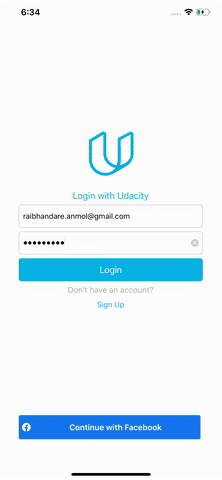

# OnTheMap
Udacity iOS Nanodegree Project

#### Summary 
This application was created specifically for Udacity's iOS Developer Nanodegree. The On The Map app allows users to share their location and a URL with their fellow students. To visualize this data, On The Map uses a map with pins for location and pin annotations for student names and URLs, allowing students to place themselves “on the map,” so to speak. 

First, the user logs in to the app using their Udacity username and password. After login, the app downloads locations and links previously posted by other students. These links can point to any URL that a student chooses. We encourage students to share something about their work or interests.

After viewing the information posted by other students, a user can post their own location and link. The locations are specified with a string and forward geocoded. They can be as specific as a full street address or as generic as “Costa Rica” or “Seattle, WA.”

The app has three view controller scenes:
 - Login View: Allows the user to log in using their Udacity credentials, or (as an extra credit exercise) using their Facebook account
 - Map and Table Tabbed View: Allows users to see the locations of other students in two formats.  
 - Information Posting View: Allows the users specify their own locations and links.

Project Rubrics can be found [here](https://docs.google.com/document/d/1tPF1tmSzVYPSbpl7_JCeMKglKMIs3dUa4OrSAKEYNAs/pub?embedded=true).

#### Requirements
- Xcode 11.4
- Swift 5

#### Technologies Used In Application:
- Accessing networked data using Apple’s URL loading framework
- Authenticating a user using over a network connection
- Creating user interfaces that are responsive, and communicate network activity
- Use Core Location and the MapKit framework for to display annotated pins on a map
- Facebook Login
- Swift

#### Implementation
- The app contains a StudentInformation struct with appropriate properties for locations and links.
- The `struct` has an `init()` method that accepts a dictionary as an argument, or the struct conforms to the `Codable` protocol.
- The `StudentInformation structs` are stored as an array (or other suitable data structure) inside a separate `model` class.
- The app displays downloaded data in a tabbed view with two tabs: a map and a table.
- The map view has a pin for each student in the correct location.
- Tapping the pins shows an annotation with the student's name and the link the student posted.
- Tapping a student’s pin annotation opens the student’s link in Safari or a web view.
- The table view has a row for each downloaded record with the student’s name displayed and is sorted.
- Tapping a row in the table opens the default device browser to the student's link.
- The Student Locations Tabbed View has a logout button in the upper left corner of the navigation bar to log out of current session.
- The Information Posting view prompts users to enter a string representing their location.
- The app allows users to add a URL to be included with their location.
- When a "Submit" button is pressed, the app forward geocodes the address string and stores the resulting latitude and longitude. Foward geocoding can be accomplished using CLGeocoder's `geocodeAddressString()` or MKLocalSearch's `startWithCompletionHandler()`.
- The networking and JSON parsing code is located in a dedicated API client class (and not, for example, inside a view controller). The class uses closures for completion and error handling.
- The networking code uses Swift's built-in `URLSession` library and the JSON parsing code uses Swift's built-in `JSONSerialization` library or `Codable` framework.

